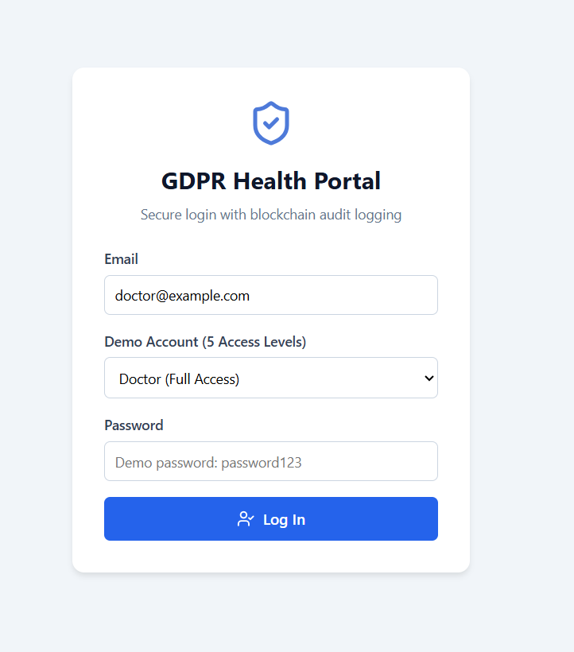
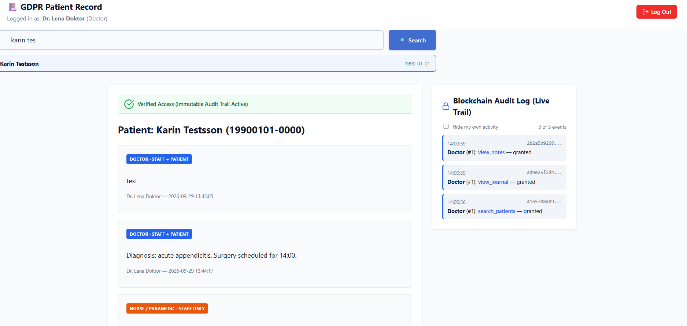
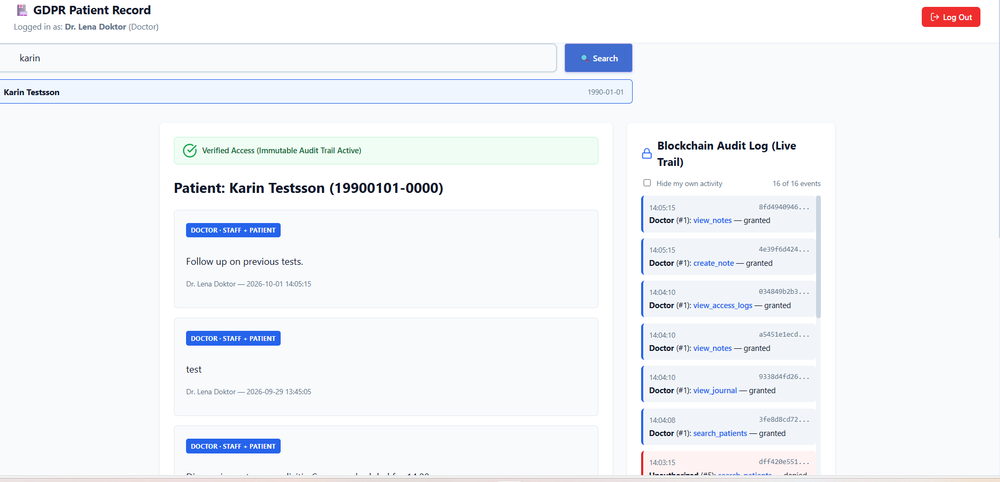
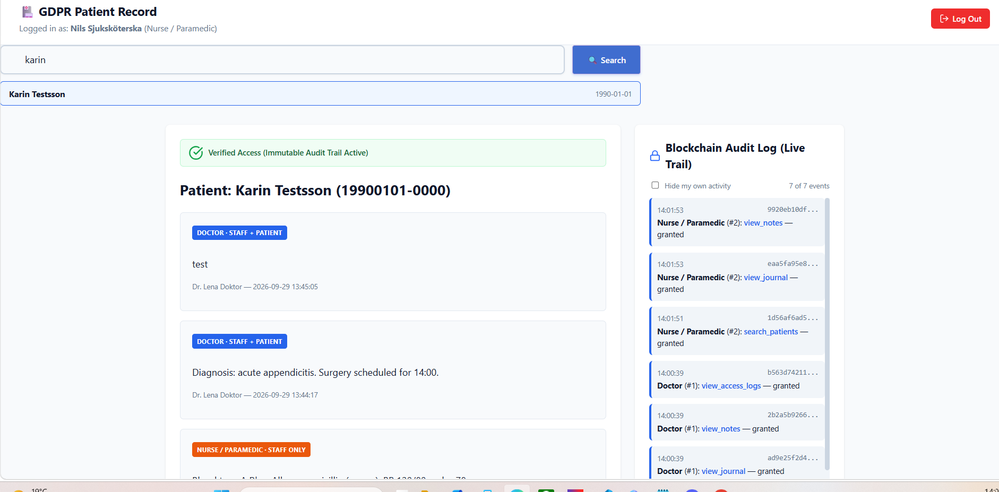

# Patient Journal System

Skolprojekt för kursmomentet Blockchain/Node.js. Ett journalsystem där de
faktiska patientuppgifterna lagras i en vanlig SQL-databas, men där varje
gång någon tittar på eller skriver i en journal skapas en signerad,
manipuleringssäker logg-post på en egenbyggd blockkedja. Tanken är att
efterlikna GDPR-kravet på att en patient ska kunna se exakt vem som har
öppnat deras journal - även om personen i fråga försöker dölja det.

## Funktioner

- Inloggning med fem roller: läkare, sjuksköterska/ambulanspersonal,
  vårdcentral, patient och en "obehörig" roll utan åtkomst
- Sök patient, öppna journal, se och skriva anteckningar
- Tre synlighetsnivåer på anteckningar: privat (bara den som skrev den),
  vårdpersonal, eller alla (inkl. patienten)
- Varje journalöppning, sökning och anteckning loggas som ett signerat block
  på blockkedjan - både lyckade och nekade försök
- Två backend-servrar kan köras samtidigt (simulerar t.ex. ett sjukhus och en
  ambulans) som synkar blockkedjan och nya anteckningar mellan varandra via
  ett eget P2P-lager, med live-uppdatering i gränssnittet

## Skärmdumpar

**Inloggning** - fem roller att välja mellan, inloggning sker mot det riktiga API:et (inte hårdkodat i webbläsaren):



**Läkarvy** - journal med anteckningar och den live access-loggen till höger:



**Samma journal senare** - fler anteckningar tillkomna, och notera den röda raden längst ner i loggen: ett nekat sökförsök från rollen "unauthorized" syns i access-trailen, precis som uppgiften kräver:



**Sjuksköterskevy** - samma patient, men en annan uppsättning synliga anteckningar och en egen access-logg eftersom rollen skiljer sig från läkarens:



_Kvar att lägga till: patientens egen vy, "Åtkomst nekad"-sidan för rollen unauthorized, samt en bild som visar live-uppdateringen mellan de två P2P-servrarna._

## Så kommer du igång

Projektet består av två delar som körs separat: `backend/` (Express-API +
blockkedja + P2P) och `frontend/` (React).

```bash
# Backend
cd backend
npm install
cp .env.example .env
npm run seed      # skapar testpatienter och en inloggning per roll
npm run dev        # startar API:et på http://localhost:3001

# Frontend (i ett eget terminalfönster)
cd frontend
npm install
npm run dev        # startar på http://localhost:3000
```

Testkonton (lösenord `password123` för alla): `doctor@example.com`,
`nurse@example.com`, `clinic@example.com`, `patient@example.com`,
`unauthorized@example.com`.

**Om `npm install` i `backend/` klagar på Python/node-gyp:** det beror på att
`better-sqlite3` försöker kompilera om sig själv istället för att använda en
färdigbyggd binär, vilket kan hända beroende på Node-version/plattform.
Enklast är att installera Python 3, eller köra `npm install
better-sqlite3@11.10.0` manuellt om problemet kvarstår.

### Köra två servrar samtidigt (P2P-demo)

1. Starta server 1 (`PORT=3001 SERVER_ID=hospital-1`) och server 2
   (`PORT=3002 SERVER_ID=hospital-2`) var för sig, med tomt `PEER_PUBLIC_KEYS`
   första gången - då skapar varje server sitt eget nyckelpar under
   `keys/`.
2. Stoppa dem, och fyll i varje servers `.env` med den andra serverns
   publika nyckel, t.ex. `PEER_PUBLIC_KEYS=hospital-2=./keys/hospital-2.public.pem`.
3. Starta båda igen. De ska logga `peer authenticated` mot varandra.
4. Låt båda peka på samma `DB_PATH` (samma SQLite-fil) så de delar
   journaldata, precis som två verkliga vårdinstanser skulle göra mot en
   gemensam patientdatabas.

Se `backend/README.md` för fler detaljer och en full endpoint-lista.

## Databasstruktur

All medicinsk data (patienter, anteckningar) ligger i SQLite. Access-loggarna
ligger **aldrig** i SQL - de hör hemma på blockkedjan istället, enligt
GDPR-kravet i uppgiften. Fullständigt CREATE-script:
[`backend/database/schema.sql`](backend/database/schema.sql).

```sql
CREATE TABLE patients (
  id INTEGER PRIMARY KEY AUTOINCREMENT,
  full_name TEXT NOT NULL,
  personal_number TEXT NOT NULL UNIQUE,
  date_of_birth TEXT,
  created_at TEXT NOT NULL DEFAULT (datetime('now'))
);

CREATE TABLE users (
  id INTEGER PRIMARY KEY AUTOINCREMENT,
  name TEXT NOT NULL,
  email TEXT NOT NULL UNIQUE,
  password_hash TEXT NOT NULL,
  role TEXT NOT NULL CHECK (role IN ('doctor', 'nurse', 'clinic', 'patient', 'unauthorized')),
  patient_id INTEGER REFERENCES patients(id),  -- satt bara för role = 'patient'
  created_at TEXT NOT NULL DEFAULT (datetime('now'))
);

CREATE TABLE notes (
  id INTEGER PRIMARY KEY AUTOINCREMENT,
  patient_id INTEGER NOT NULL REFERENCES patients(id),
  author_user_id INTEGER NOT NULL REFERENCES users(id),
  content TEXT NOT NULL,
  visibility TEXT NOT NULL CHECK (visibility IN ('private', 'staff', 'all')),
  created_at TEXT NOT NULL DEFAULT (datetime('now'))
);
```

Access-loggarna (vem har tittat på vad, och om det godkändes eller
nekades) lagras istället som signerade block i blockkedjan, se
`backend/src/blockchain/`.

## Teknikstack

- **Frontend:** React + Vite, React Router
- **Backend:** Node.js + Express, SQLite (better-sqlite3), express-session
- **Blockkedja:** egen implementation (block, hashning, Ed25519-signering,
  Merkle-träd för batchade loggar)
- **P2P:** WebSocket-baserad synk mellan servrarna, egen handskakning för
  att verifiera att en peer är den den säger sig vara

## Vilka har jobbat med det

- **Fredrik** - Express API, databas, auktorisering, audit-logg-middleware
- **Ellinor** - Frontend (React)
- **Arwid** - Blockkedjan, samt P2P-nätverket
- **Ahmed** - P2P-nätverk (tilldelat ansvar enligt gruppkontraktet)

## Gruppdokumentation

- [`contract.md`](contract.md) - gruppkontrakt
- [`prodjectmeetings.md`](prodjectmeetings.md) - loggbok över projektmöten
- [`assignement.md`](assignement.md) - uppgiftsbeskrivningen
